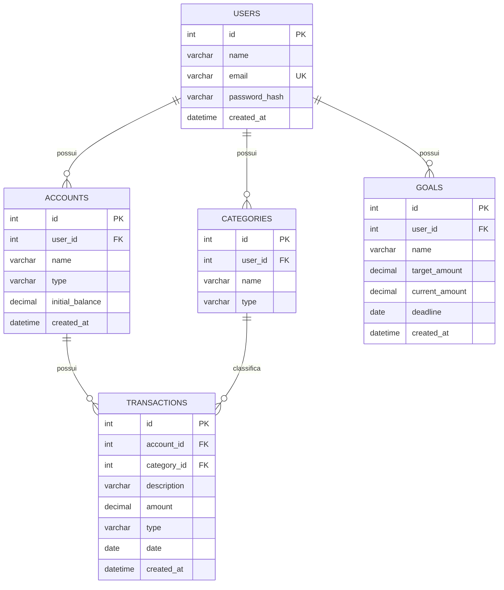

# Diagrama Entidade-Relacionamento — 5 Centavos

## 1. Objetivo

Este documento apresenta o **Diagrama Entidade-Relacionamento (DER)** do 5 Centavos.

O diagrama representa visualmente as principais entidades do sistema, seus atributos e os relacionamentos existentes entre elas.

O modelo foi elaborado com base nos requisitos, regras de negócio, casos de uso e modelo de dados definidos para o projeto.

---

## 2. Entidades

O modelo inicial do 5 Centavos é composto pelas seguintes entidades:

* `users` — Usuários;
* `accounts` — Contas financeiras;
* `categories` — Categorias;
* `transactions` — Transações;
* `goals` — Metas financeiras.

---

## 3. Diagrama



---

## 4. Relacionamentos

### 4.1 Usuário → Contas

```text
USERS 1 ───────── N ACCOUNTS
```

Um usuário pode possuir várias contas financeiras.

Cada conta financeira pertence a apenas um usuário.

---

### 4.2 Usuário → Categorias

```text
USERS 1 ───────── N CATEGORIES
```

Um usuário pode possuir várias categorias.

Cada categoria pertence a apenas um usuário.

---

### 4.3 Usuário → Metas

```text
USERS 1 ───────── N GOALS
```

Um usuário pode possuir várias metas financeiras.

Cada meta pertence a apenas um usuário.

---

### 4.4 Conta → Transações

```text
ACCOUNTS 1 ───────── N TRANSACTIONS
```

Uma conta pode possuir várias transações.

Cada transação deverá estar vinculada a uma conta financeira existente.

---

### 4.5 Categoria → Transações

```text
CATEGORIES 1 ───────── N TRANSACTIONS
```

Uma categoria pode ser utilizada por várias transações.

Cada transação deverá possuir uma categoria compatível com seu tipo.

---

## 5. Chaves

### Chaves primárias

As chaves primárias são identificadas pela sigla `PK` (**Primary Key**).

| Entidade       | Chave primária |
| -------------- | -------------- |
| `users`        | `id`           |
| `accounts`     | `id`           |
| `categories`   | `id`           |
| `transactions` | `id`           |
| `goals`        | `id`           |

### Chaves estrangeiras

As chaves estrangeiras são identificadas pela sigla `FK` (**Foreign Key**).

| Entidade       | Campo         | Referência      |
| -------------- | ------------- | --------------- |
| `accounts`     | `user_id`     | `users.id`      |
| `categories`   | `user_id`     | `users.id`      |
| `transactions` | `account_id`  | `accounts.id`   |
| `transactions` | `category_id` | `categories.id` |
| `goals`        | `user_id`     | `users.id`      |

---

## 6. Cardinalidade

A cardinalidade representa quantos registros de uma entidade podem estar relacionados a outra.

O modelo utiliza principalmente relacionamentos **1:N (um para muitos)**.

```text
1:N = Um registro pode estar relacionado a vários registros.
```

Exemplo:

```text
USERS 1 ───────── N ACCOUNTS
```

Significa:

> Um usuário pode possuir várias contas, mas uma conta pertence a apenas um usuário.

---

## 7. Regras de integridade

O banco de dados deverá garantir as seguintes condições:

* Toda conta deverá possuir um usuário válido;
* Toda categoria deverá possuir um usuário válido;
* Toda meta deverá possuir um usuário válido;
* Toda transação deverá possuir uma conta válida;
* Toda transação deverá possuir uma categoria válida;
* Um usuário não poderá acessar dados pertencentes a outro usuário;
* O tipo de uma transação deverá ser `RECEITA` ou `DESPESA`;
* O tipo da categoria deverá ser compatível com o tipo da transação;
* Valores financeiros deverão respeitar as regras definidas em `regras-de-negocio.md`.

---

## 8. Fluxo dos dados

O fluxo principal das informações financeiras pode ser representado da seguinte maneira:

```text
                         ┌──────────────┐
                         │    USERS     │
                         └──────┬───────┘
                                │
                    ┌───────────┼───────────┐
                    │           │           │
                    ▼           ▼           ▼
               ACCOUNTS    CATEGORIES     GOALS
                    │           │
                    │           │
                    └─────┬─────┘
                          │
                          ▼
                    TRANSACTIONS
```

As transações representam o principal conjunto de dados financeiros do sistema e poderão posteriormente alimentar processos de **Analytics, ETL e Inteligência Artificial**.

---

## 9. Relação com Ciência de Dados

A estrutura do banco foi planejada considerando a futura utilização dos dados em análises.

A entidade `transactions` será especialmente importante para análises como:

* Gastos por categoria;
* Receitas por período;
* Evolução das despesas;
* Evolução do saldo;
* Comparação mensal;
* Média de gastos;
* Identificação de padrões;
* Indicadores financeiros;
* Modelos de Machine Learning;
* Análises realizadas por Inteligência Artificial.

Dessa forma, o banco de dados não será utilizado apenas para armazenar informações, mas também como uma das principais fontes de dados para as etapas futuras do projeto.

---

## 10. Evolução do DER

O DER apresentado representa a estrutura inicial do 5 Centavos.

Conforme novas funcionalidades forem implementadas, novas entidades e relacionamentos poderão ser adicionados.

Possíveis entidades futuras incluem:

```text
BUDGETS
RECURRING_TRANSACTIONS
ATTACHMENTS
NOTIFICATIONS
AUDIT_LOGS
IMPORTS
AI_INSIGHTS
```

Essas entidades somente deverão ser incorporadas quando houver uma necessidade funcional definida.

---

## 11. Referências

Este DER foi elaborado com base nos seguintes documentos do projeto:

* `especificacao.md`;
* `requisitos.md`;
* `regras-de-negocio.md`;
* `casos-de-uso.md`;
* `modelo-de-dados.md`.

Qualquer alteração significativa no modelo deverá ser refletida nesses documentos quando necessário e registrada no histórico do Git.
